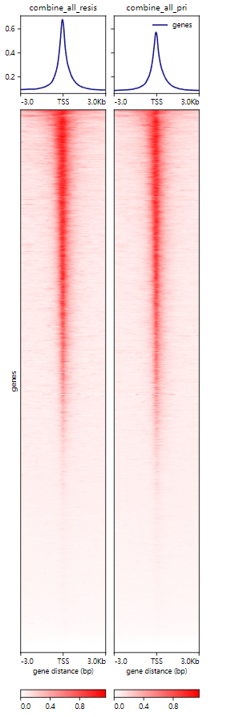
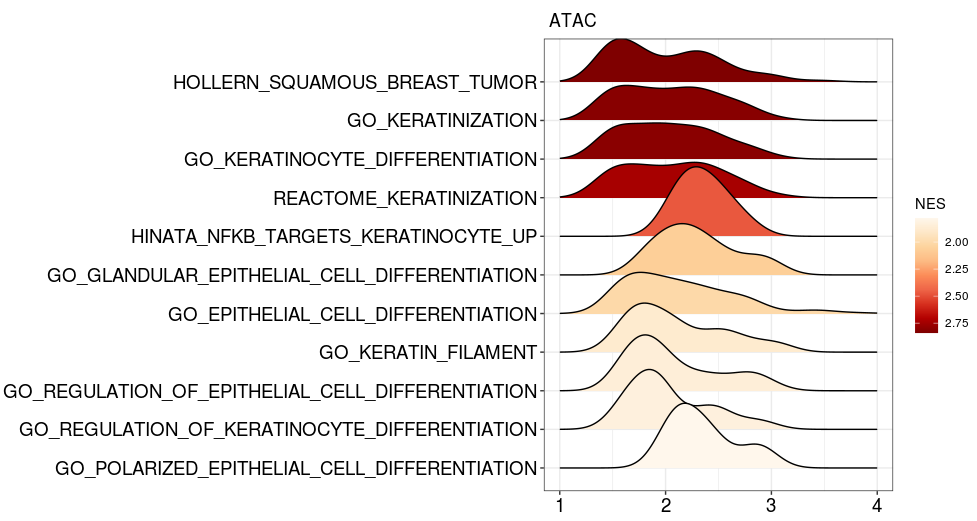
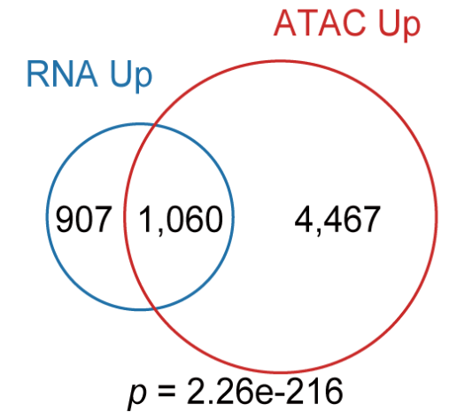
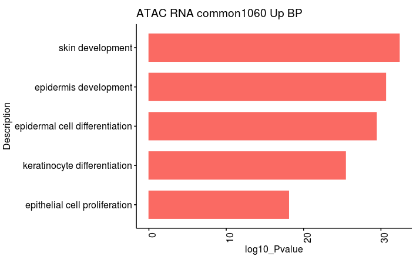
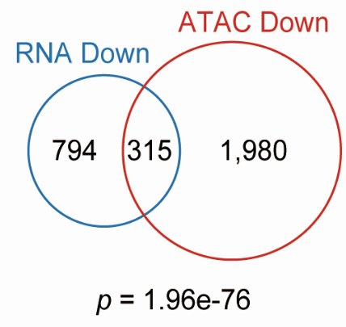
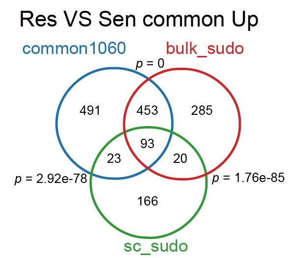
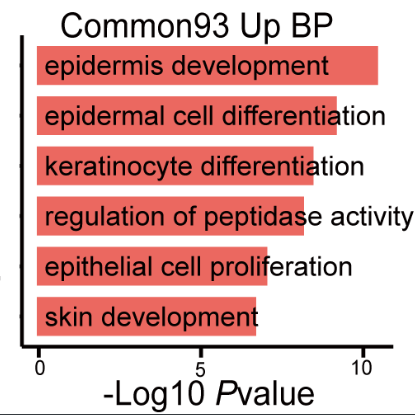

# Bulk ATAC-seq analysis

## In this pipeline, we showed the detail codes of visualization of ATAC-seq data.

~~~linux
# draw the heatmap of ATAC-seq
computeMatrix reference-point --referencePoint TSS -b 3000 -a 3000 \
-R mm10.ucsc.refseq.bed  \
-S ATAC_sensitive_all.bw ATAC_resistant_all.bw \
--skipZeros --numberOfProcessors 25 \
-o ATAC_all_TSS.mat.gz 

plotHeatmap -m ATAC_all_TSS.mat.gz -out ATAC_all_TSS.svg \
 --colorList  'white,red' 'white,red'
~~~

## Part1. we should load the packages  and the data we need for following analysis

~~~R
suppressPackageStartupMessages({
  library(dplyr)
  library(Seurat)
  library(Matrix)
  library(proxy)
  library(gplots)
  library(Rtsne)
  library(densityClust)
  library(irlba)
  library(monocle)
  library(plyr)
  library(DOSE)
  library(clusterProfiler)
  library(topGO)
  library(pathview)
  library(org.Mm.eg.db)
  library(org.Hs.eg.db)
  library(AnnotationDbi)
  library(cowplot)
  library(ggplot2)
  library(VGAM)
  library(gtools)
  library(RSCORE)
  library(GSVA)
library(GSEABase)
library(GSVAdata)
data(c2BroadSets)
c2BroadSets
library(Biobase)
library(genefilter)
library(limma)
library(RColorBrewer)
library(GSVA)
library(edgeR)
library(BisqueRNA)
library(RColorBrewer)
library(trqwe)
library(ggpubr)
require(ComplexHeatmap)
require(BuenColors)
require(scales)
library(nichenetr)
library(tidyverse)
library(iTALK)
library(MuSiC)
library(tidyr)
library(DESeq2)
library("survival")
library("survminer")
library(pheatmap)
library(corrplot)
})
source("./MyBestFunction_scRNA.R")
library(future)
library(future.apply)
library(data.table)
library(VennDiagram)
options(future.globals.maxSize = 3000 * 1024^2)
plan("multiprocess", workers = 8)
plan()
library(TxDb.Mmusculus.UCSC.mm10.knownGene)
txdb <- TxDb.Mmusculus.UCSC.mm10.knownGene

###load the data
ATAC_all_sig <- mcreadRDS("./Bulk_ATACseq/RData_files/ATAC_Ren_vs_Sen_sig_result.rds",mc.cores=20)
RNA_Resis_vs_Sen <- read.csv(file="./Bulk_RNAseq/csv_files/1_RNAseq_Resis_vs_Sen_count_tpm_all_result.csv")
all_result_DDP <- read.csv(file="./Bulk_RNAseq/csv_files/1_RNAseq_DDP_vs_Sen_count_tpm_all_result.csv")
pseudotime_gene <- mcreadRDS(file="./sc-RNAseq/RData_files/1_mouse_sc_RNA_pseudotime_gene_module_gene.rds",mc.cores=20)
ALL_GSEA_GMT <- read.gmt("./msigdb.v7.1.symbols.gmt")
~~~

~~~R
ALL_GSEA_GMT$ont <- as.character(ALL_GSEA_GMT$ont)
EPITHELIAL <- unique(grep("*EPITHELIAL_CELL_DIFFERENTIATION",ALL_GSEA_GMT$ont,value=TRUE))
KERATIN <- unique(grep("*KERATIN",ALL_GSEA_GMT$ont,value=TRUE))
SQUAMOUS <- unique(grep("*SQUAM",ALL_GSEA_GMT$ont,value=TRUE))
all_pathway <- c(EPITHELIAL,KERATIN,SQUAMOUS)
KERATIN_GSEA <- XY_subset(ALL_GSEA_GMT,"ont",all_pathway)

ATAC_all_sig_uni1 <- future_lapply(1:length(unique(ATAC_all_sig$SYMBOL)),function(x) {
  sel_gene <- unique(ATAC_all_sig$SYMBOL)[x]
  sel_gene_d <- subset(ATAC_all_sig,SYMBOL==sel_gene)
  sel_gene_d_n <- subset(sel_gene_d,abs(log2FoldChange)==max(abs(sel_gene_d$log2FoldChange)))
  return(sel_gene_d_n)
  })
ATAC_all_sig_uni1 <- as.data.frame(rbindlist(ATAC_all_sig_uni1))
ATAC_data <- ATAC_all_sig_uni1 %>% mutate(mouse_symbol = convert_mouse_to_human_symbols(as.character(ATAC_all_sig_uni1$SYMBOL))) %>% drop_na()
ATAC_data <- ATAC_data[order(ATAC_data$log2FoldChange,decreasing=TRUE),]
hsg_genelist <- ATAC_data$log2FoldChange
names(hsg_genelist) <- ATAC_data$mouse_symbol
hsg_egmt2 <- GSEA(hsg_genelist, TERM2GENE=KERATIN_GSEA, verbose=TRUE,minGSSize=2,pvalueCutoff = 0.05)
aa <- jdb_palette("brewer_heat",type = "continuous")[1:length(jdb_palette("brewer_heat",type = "continuous"))]
tmp_files <- XY_ridgeplot.gseaResult(hsg_egmt2,fill="NES", core_enrichment = TRUE)
tmp_files1 <- XY_ridgeplot.gseaResult(hsg_egmt2,fill="pvalue", core_enrichment = TRUE)
tmp_files$pvalue <- tmp_files1$pvalue
tmp_files <- subset(tmp_files,category!="GO_NEGATIVE_REGULATION_OF_EPITHELIAL_CELL_DIFFERENTIATION")
tmp_files <- subset(tmp_files,category!="HINATA_NFKB_TARGETS_KERATINOCYTE_DN")
tmp_files <- subset(tmp_files,category!="ENK_UV_RESPONSE_KERATINOCYTE_DN")

ggplot(tmp_files, aes_string(x="value", y="category", fill="NES")) + ggridges ::geom_density_ridges() +
    scale_fill_gradientn(name = "NES", colors=aa, guide=guide_colorbar(reverse=TRUE)) + xlim(1,4)+
    xlab(NULL) + ylab(NULL) +  theme_dose()+labs(title=c(" ATAC "))
~~~

~~~R
ATAC_Up <- subset(ATAC_all_sig,threshold=="Up")
ATAC_Down <- subset(ATAC_all_sig,threshold=="Down")
Resis_vs_Sen_Up <- subset(RNA_Resis_vs_Sen,Resis_vs_Sen_threshold=="Up")
Resis_vs_Sen_Down <- subset(RNA_Resis_vs_Sen,Resis_vs_Sen_threshold=="Down")

dev.off()
T<-venn.diagram(list(RNA_Up=na.omit(Resis_vs_Sen_Up$symbol),ATAC_Up=na.omit(ATAC_Up$SYMBOL)),
filename=NULL,
lwd=1,                         #圈线粗度
lty=1,                         #圈线类型
col=c("#F8766D", "#A3A500"),    #圈线颜色
fill=c("#F8766D", "#A3A500"),   #填充颜色
cat.col=c("#F8766D", "#A3A500"),#A和B的颜色
cat.cex = 2.5,                 #A和B的大小
rotation.degree = 45,          #旋转角度
main = "RNA_Up & ATAC_Up",                  #主标题内容
main.cex = 2,                  #主标题大小
sub = "RNA_Up & ATAC_Up",        #亚标题内容
sub.cex = 1,                   #亚标题字大小
cex=3,                       #里面交集字的大小
alpha = 0.5,                   #透明度
reverse=TRUE)
grid.draw(T)
common_gene <- intersect(na.omit(Resis_vs_Sen_Up$symbol),na.omit(ATAC_Up$SYMBOL))
data1_left <- setdiff(na.omit(Resis_vs_Sen_Up$symbol),common_gene)
data2_left <- setdiff(na.omit(ATAC_Up$SYMBOL),common_gene)
enrich_pvalue(24223, length(data1_left), length(data2_left), length(common_gene))
~~~

~~~R
common_1060_gene <- data.frame(gene=common_gene,group=c("common_1060"))
common_1060_gene$ENTREZID <- mapIds(x = org.Mm.eg.db,
                        keys = as.character(common_1060_gene$gene),
            keytype ="SYMBOL",
            column ="ENTREZID",
            multiVals="first")
ee  <-as.matrix(common_1060_gene$ENTREZID)
dd <- as.vector(ee)
GOupres_1_all <- enrichGO(gene = dd, 
           OrgDb = org.Mm.eg.db,
      ont = "all", 
               pvalueCutoff = 0.01, 
                   pAdjustMethod = "BH", 
                   qvalueCutoff = 0.05,
                   minGSSize = 10, 
                   maxGSSize = 500, 
                   readable = TRUE, 
                   pool = FALSE)
GO_up_RNA <- as.data.frame(GOupres_1_all)
GO_up_RNA_BP <- subset(GO_up_RNA,ONTOLOGY=="BP")
GO_up_RNA$log10_Pvalue <- -log(GO_up_RNA$pvalue,10)
GO_up_RNA_5 <- head(GO_up_RNA,5)
ggbarplot(GO_up_RNA_5, 
  x = "Description", 
  y = "log10_Pvalue",
  color = "#FA6A63",            # Set bar border colors to white
  fill ="#FA6A63",
  sort.val = "asc",          # Sort the value in dscending order
  x.text.angle = 90,           # Rotate vertically x axis texts
  rotate = TRUE,
  title="ATAC RNA common1060 Up BP")
~~~

~~~R
dev.off()
T<-venn.diagram(list(RNA_Down=na.omit(Resis_vs_Sen_Down$symbol),ATAC_Down=na.omit(ATAC_Down$SYMBOL)),
filename=NULL,
lwd=1,                         #圈线粗度
lty=1,                         #圈线类型
col=c("#F8766D", "#A3A500"),    #圈线颜色
fill=c("#F8766D", "#A3A500"),   #填充颜色
cat.col=c("#F8766D", "#A3A500"),#A和B的颜色
cat.cex = 2.5,                 #A和B的大小
rotation.degree = 45,          #旋转角度
main = "RNA_Down & ATAC_Down",                  #主标题内容
main.cex = 2,                  #主标题大小
sub = "RNA_Down & ATAC_Down",        #亚标题内容
sub.cex = 1,                   #亚标题字大小
cex=3,                       #里面交集字的大小
alpha = 0.5,                   #透明度
reverse=TRUE)
grid.draw(T)
common_gene <- intersect(na.omit(Resis_vs_Sen_Down$symbol),na.omit(ATAC_Down$SYMBOL))
data1_left <- setdiff(na.omit(Resis_vs_Sen_Down$symbol),common_gene)
data2_left <- setdiff(na.omit(ATAC_Down$SYMBOL),common_gene)
enrich_pvalue(24223, length(data1_left), length(data2_left), length(common_gene))
~~~

~~~R
sudo_Up_gene <- subset(pseudotime_gene,Module=="Module_3" |Module=="Module_4" )

all_result_DDP_Res <- cbind(all_result_DDP,RNA_Resis_vs_Sen[,c(14:20)])
all_result_DDP_Res$mean_Sen <- apply(all_result_DDP_Res[,c(14:16)],1,mean)
all_result_DDP_Res$mean_DDP2 <- apply(all_result_DDP_Res[,c(17:19)],1,mean)
all_result_DDP_Res$mean_DDP4 <- apply(all_result_DDP_Res[,c(20:22)],1,mean)
all_result_DDP_Res$mean_Ren <- apply(all_result_DDP_Res[,c(23:25)],1,mean)
all_result_DDP_Res$new_threshold <- ifelse(all_result_DDP_Res$mean_DDP2 > all_result_DDP_Res$mean_Sen & all_result_DDP_Res$mean_DDP4 > all_result_DDP_Res$mean_DDP2 & all_result_DDP_Res$mean_Ren > all_result_DDP_Res$mean_DDP4,1,0)
bulk_sudo_Up <- subset(all_result_DDP_Res,new_threshold=="1")
bulk_sudo_Up <- subset(bulk_sudo_Up,Resis_vs_Sen_threshold=="Up")
bulk_sudo_Up <- bulk_sudo_Up[order(bulk_sudo_Up$Resis_vs_Sen_log2FoldChange,decreasing=TRUE),]

dev.off()
T<-venn.diagram(list(bulk_sudo_Up=na.omit(bulk_sudo_Up$symbol),common_1060=na.omit(common_1060_gene$gene),sudo_Up_gene=na.omit(sudo_Up_gene$symbol)),
filename=NULL,
lwd=1,                         #圈线粗度
lty=1,                         #圈线类型
col=c("#F8766D", "#A3A500","#d986ed"),    #圈线颜色
fill=c("#F8766D", "#A3A500","#d986ed"),   #填充颜色
cat.col=c("#F8766D", "#A3A500","#d986ed"),#A和B的颜色
cat.cex = 2.5,                 #A和B的大小
rotation.degree = 45,          #旋转角度
main = "common_1060 & under_Up & sudo_Up_gene",                  #主标题内容
main.cex = 2,                  #主标题大小
sub = "common_1060 & under_Up& sudo_Up_gene",        #亚标题内容
sub.cex = 1,                   #亚标题字大小
cex=3,                       #里面交集字的大小
alpha = 0.5,                   #透明度
reverse=TRUE)
grid.draw(T)

common_gene <- intersect(na.omit(bulk_sudo_Up$symbol),na.omit(common_1060_gene$gene))
data1_left <- setdiff(na.omit(bulk_sudo_Up$symbol),common_gene)
data2_left <- setdiff(na.omit(common_1060_gene$gene),common_gene)
enrich_pvalue(24223, length(data1_left), length(data2_left), length(common_gene))

common_gene <- intersect(na.omit(sudo_Up_gene$symbol),na.omit(common_1060_gene$gene))
data1_left <- setdiff(na.omit(sudo_Up_gene$symbol),common_gene)
data2_left <- setdiff(na.omit(common_1060_gene$gene),common_gene)
enrich_pvalue(24223, length(data1_left), length(data2_left), length(common_gene))

common_gene <- intersect(na.omit(sudo_Up_gene$symbol),na.omit(bulk_sudo_Up$symbol))
data1_left <- setdiff(na.omit(sudo_Up_gene$symbol),common_gene)
data2_left <- setdiff(na.omit(bulk_sudo_Up$symbol),common_gene)
enrich_pvalue(24223, length(data1_left), length(data2_left), length(common_gene))
~~~

~~~R
common_gene <- intersect(intersect(na.omit(bulk_sudo_Up$symbol),na.omit(common_1060_gene$gene)),na.omit(sudo_Up_gene$symbol))
common_93_gene <- data.frame(gene=common_gene,group=c("common_93"))
write.csv(common_93_gene,file="./Bulk_ATACseq/RData_files/1_common93_ATAC_RNA_sc_Up.csv")

common_93_gene <- data.frame(gene=common_gene,group=c("common_93"))
common_93_gene$ENTREZID <- mapIds(x = org.Mm.eg.db,
                        keys = as.character(common_93_gene$gene),
            keytype ="SYMBOL",
            column ="ENTREZID",
            multiVals="first")
ee  <-as.matrix(common_93_gene$ENTREZID)
dd <- as.vector(ee)
GOdownres_1_all <- enrichGO(gene = dd, 
           OrgDb = org.Mm.eg.db,
      ont = "all", 
               pvalueCutoff = 0.01, 
                   pAdjustMethod = "BH", 
                   qvalueCutoff = 0.05,
                   minGSSize = 10, 
                   maxGSSize = 500, 
                   readable = TRUE, 
                   pool = FALSE)
GO_up_RNA <- as.data.frame(GOdownres_1_all)
GO_up_RNA_BP <- subset(GO_up_RNA,ONTOLOGY=="BP")
GO_up_RNA$log10_Pvalue <- -log(GO_up_RNA$pvalue,10)
GO_up_RNA_6 <- head(GO_up_RNA,6)
ggbarplot(GO_up_RNA_6, 
  x = "Description", 
  y = "log10_Pvalue",
  color = "#FA6A63",            # Set bar border colors to white
  fill ="#FA6A63",
  sort.val = "asc",          # Sort the value in dscending order
  x.text.angle = 90,           # Rotate vertically x axis texts
  rotate = TRUE,
  title="common93 Up BP")
~~~

