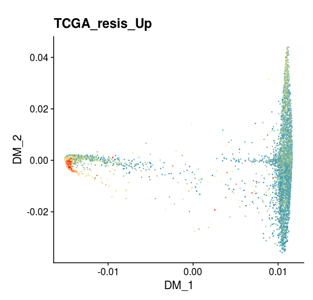

# mouse sc-RNAseq data analysis

## Part1. we should load the packages we need for following analysis

~~~R
suppressPackageStartupMessages({
  library(dplyr)
  library(Seurat)
  library(Matrix)
  library(proxy)
  library(gplots)
  library(Rtsne)
  library(densityClust)
  library(irlba)
  library(monocle)
  library(plyr)
  library(DOSE)
  library(clusterProfiler)
  library(topGO)
  library(pathview)
  library(org.Mm.eg.db)
  library(org.Hs.eg.db)
  library(AnnotationDbi)
  library(cowplot)
  library(ggplot2)
  library(VGAM)
  library(gtools)
  library(RSCORE)
  library(GSVA)
library(GSEABase)
library(GSVAdata)
data(c2BroadSets)
c2BroadSets
library(Biobase)
library(genefilter)
library(limma)
library(RColorBrewer)
library(GSVA)
library(edgeR)
library(BisqueRNA)
library(RColorBrewer)
library(trqwe)
library(ggpubr)
require(ComplexHeatmap)
require(BuenColors)
require(scales)
library(nichenetr)
library(tidyverse)
library(iTALK)
library(MuSiC)
library(tidyr)
library(DESeq2)
library("survival")
library("survminer")
library(pheatmap)
library(corrplot)
})
source("./MyBestFunction_scRNA.R")
library(future)
library(future.apply)
options(future.globals.maxSize = 3000 * 1024^2)
plan("multiprocess", workers = 8)
plan()
~~~

## Part2. we should load the data we need for following analysis

~~~R
sc_mouse_merge <- mcreadRDS(file="/mnt/data/user_data/xuelan/project/3_singlecell/7_wangmanli/PDF_result/8_2020new/15_figure_share/sc-RNAseq/RData_files/mouse_singlecell_RNAseq_all.rds",mc.cores=20)
sc_mouse_tumor_sdo <- mcreadRDS(file="/mnt/data/user_data/xuelan/project/3_singlecell/7_wangmanli/PDF_result/8_2020new/15_figure_share/sc-RNAseq/RData_files/mouse_singlecell_RNAseq_tumor_pseudotime.rds",mc.cores=20)
resProgressive_vs_Response <- read.csv(file="./sc-RNAseq/RData_files/TCGA_BLCA_resis_vs_respon_DSEq2_result.csv")
ALL_GSEA_GMT <- read.gmt("./msigdb.v7.1.symbols.gmt")
~~~

## Part3. The detail codes of visualization of  mouse sc-RNAseq data

~~~R
sc_mouse_merge$xl_anno <- factor(sc_mouse_merge$xl_anno,levels=c("Tumor1","Tumor2","Neutrophil","Macrophage","Stromal","epithelia","endothelia","Muscle","NK"))
Idents(object = sc_mouse_merge)  <- "xl_anno"
DimPlot(sc_mouse_merge, reduction = "tsne", group.by="xl_anno",label = FALSE, pt.size = 0.8,cols=as.character(jdb_palette("corona",9))) 
~~~

~~~R
Idents(object = sc_mouse_merge) <- c("xl_anno")
new.cluster.ids <- c("Tumor1","Tumor2","other","other","other","other","other","other","other")
names(new.cluster.ids) <- levels(sc_mouse_merge)
sc_mouse_merge <- RenameIdents(sc_mouse_merge, new.cluster.ids)
sc_mouse_merge$tumor_anno <- Idents(object = sc_mouse_merge)
sc_mouse_merge$tumor_anno <- factor(sc_mouse_merge$tumor_anno,levels=c("Tumor1","Tumor2","other"))
sc_mouse_merge$typle <- factor(sc_mouse_merge$typle,levels=c("mouse_Sen","mouse_Ren"))
DimPlot(sc_mouse_merge, reduction = "tsne", group.by="tumor_anno",split.by="typle",label = FALSE, pt.size = 0.4,cols=c("#1f77b4","#d62728","#bcb6b6")) 
~~~

~~~R
sc_mouse_merge$xl_anno <- factor(sc_mouse_merge$xl_anno,levels=c("endothelia","epithelia","Macrophage","Muscle","Neutrophil","NK","Stromal","Tumor1","Tumor2"))
marker_gene1 <- c("LUCI2LTR","Gpx2","Col1a2","Col1a1","Nkg7","Cd3g","S100a9","S100a8","Myl9","Myh11","Lyz2","Cd74","Krt8","Upk1b","Cdh5","Emcn")
DotPlot(sc_mouse_merge, features = marker_gene1,group.by="xl_anno", cols=c("#ffffff", "#B30000"),scale = TRUE,col.min = 0,col.max = 5) + RotatedAxis()
~~~

~~~R
Idents(object = sc_mouse_merge) <- c("xl_anno")
sc_mouse_merge$xl_anno <- factor(sc_mouse_merge$xl_anno,levels=c("Tumor1","Tumor2","Neutrophil","Macrophage","Stromal","epithelia","endothelia","Muscle","NK"))
new.cluster.ids <- c("Tumor1","Tumor2","other","other","other","other","other","other","other")
names(new.cluster.ids) <- levels(sc_mouse_merge)
sc_mouse_merge <- RenameIdents(sc_mouse_merge, new.cluster.ids)
sc_mouse_merge$tumor_anno <- Idents(object = sc_mouse_merge)
sc_mouse_merge$tumor_anno <- factor(sc_mouse_merge$tumor_anno,levels=c("Tumor1","Tumor2","other"))
sc_mouse_merge$Epcam <- GetAssayData(object = sc_mouse_merge, slot = "scale.data")[c("Epcam"),]
sc_mouse_merge$Epcam[which(sc_mouse_merge$tumor_anno=="other")] <- "NA"
Pesudo_FeaturePlot(object = sc_mouse_merge, features = c("Epcam"),split.by="typle",pt.size=.5,reduction="tsne",label=T,cols = CustomPalette(low ="#007BBF", mid = "#FFF485",high = "#FF0000")) 
~~~

~~~R
sc_mouse_merge$G2M.Score_new <- sc_mouse_merge$G2M.Score
Idents(object = sc_mouse_merge) <- c("xl_anno")
sc_mouse_merge$xl_anno <- factor(sc_mouse_merge$xl_anno,levels=c("Tumor1","Tumor2","Neutrophil","Macrophage","Stromal","epithelia","endothelia","Muscle","NK"))
new.cluster.ids <- c("Tumor1","Tumor2","other","other","other","other","other","other","other")
names(new.cluster.ids) <- levels(sc_mouse_merge)
sc_mouse_merge <- RenameIdents(sc_mouse_merge, new.cluster.ids)
sc_mouse_merge$tumor_anno <- Idents(object = sc_mouse_merge)
sc_mouse_merge$G2M.Score_new[which(sc_mouse_merge$tumor_anno=="other")] <- "NA"
Pesudo_FeaturePlot(object = sc_mouse_merge, features = c("G2M.Score_new"),split.by="typle",pt.size=.5,reduction="tsne",label=T,cols = CustomPalette(low ="#007BBF", mid = "#FFF485",high = "#FF0000")) 
~~~

~~~R
only_tumor <- FindMarkers(object = sc_mouse_merge, ident.1 = c("Tumor1"), ident.2 = c("Tumor2"), only.pos = FALSE, min.pct = 0.25)
only_tumor <- as.data.frame(only_tumor)
only_tumor <-subset(only_tumor,p_val< 0.05)
only_tumor <- only_tumor[order(only_tumor$avg_logFC,decreasing=T),]
only_tumor$cluster <- ifelse(only_tumor$avg_logFC > 0 ,"Tumor1","Tumor2")
only_tumor$gene <- rownames(only_tumor)

top_marker <- c()
number.group <- length(unique(only_tumor$cluster))
for (i in c(1:number.group)){
  cluster_n <- unique(only_tumor$cluster)[i]
  marker <- only_tumor[with(only_tumor,cluster==cluster_n),]
  top_marker[[i]] <- marker
  names(top_marker)[i] <- cluster_n
}
gcSampl <- c()
for (i in c(1:length(top_marker))){
t <- top_marker[[i]]
symbol <- as.character(t$gene)
DD <- symbol
t$entrez <- mapIds(x = org.Mm.eg.db,
                        keys = DD,
            keytype ="SYMBOL",
            column ="ENTREZID",
            multiVals="first")
names <- na.omit(t)
entrez <- as.character(names$entrez)
gcSampl[[i]] <- entrez
names(gcSampl)[i] <- paste(names(top_marker)[i],"entrez",sep="_")
print(paste("state_2 cluster",i,"is done",sep = " "))
}
ck_OFF_HIGH_GO_BP <- compareCluster(geneCluster = gcSampl, fun = "enrichGO",OrgDb = org.Mm.eg.db,readable=T,ont = "BP")
ck_OFF_HIGH_KEGG <- compareCluster(geneCluster = gcSampl, fun = "enrichKEGG",organism="mouse")

GO_BP <- as.data.frame(ck_OFF_HIGH_GO_BP)
GO_BP$log10_Pvalue <- -log(GO_BP$pvalue,10)
Tumor1_GO_up_RNA_5 <- head(GO_BP,5)
ggbarplot(Tumor1_GO_up_RNA_5, 
  x = "Description", 
  y = "log10_Pvalue",
  color = "#1f77b4",            # Set bar border colors to white
  fill ="#1f77b4",
  sort.val = "asc",          # Sort the value in dscending order
  x.text.angle = 90,           # Rotate vertically x axis texts
  rotate = TRUE,
  title="Tumor1 GO")
~~~

~~~R
Tumor2_GO_down_RNA_5 <- head(subset(GO_BP,Cluster=="Tumor2_entrez"),5)
ggbarplot(Tumor2_GO_down_RNA_5, 
  x = "Description", 
  y = "log10_Pvalue",
  color = "#d62728",            # Set bar border colors to white
  fill ="#d62728",
  sort.val = "asc",          # Sort the value in dscending order
  x.text.angle = 90,           # Rotate vertically x axis texts
  rotate = TRUE,
  title="Tumor2 GO")
~~~

~~~R
sel_colors <- c("#2c80c5","#e10b2b")
names_clu <- c("Tumor1", "Tumor2")
col <- sel_colors
names(col) <- names_clu
sc_mouse_tumor_sdo$xl_anno <- factor(sc_mouse_tumor_sdo$xl_anno,levels=names_clu)
DimPlot(object = sc_mouse_tumor_sdo, reduction = "dm",
  label=FALSE,pt.size=.4,
  group.by="xl_anno",
  cols=col[unique(sc_mouse_tumor_sdo$xl_anno)]) +labs(title="tumor")
~~~

~~~R
sel_colors <- c("#2c80c5","#F2673A","#e10b2b")
names_clu <- c("mouse_Sen_Tumor1", "mouse_Sen_Tumor2","mouse_Ren_Tumor2")
col <- sel_colors
names(col) <- names_clu
sc_mouse_tumor_sdo$renew <- factor(sc_mouse_tumor_sdo$renew,levels=names_clu)
DimPlot(object = sc_mouse_tumor_sdo, reduction = "dm",
  label=FALSE,pt.size=.4,
  group.by="renew",
  cols=col[unique(sc_mouse_tumor_sdo$renew)])
~~~

~~~R
XY_FeaturePlot(object = sc_mouse_tumor_sdo, features = c("slingPseudotime_1") ,pt.size=.4,nrow=1,reduction="dm",label=T,cols = CustomPalette(low ="#007BBF", mid = "#FFF485",high = "#FF0000"))+ NoAxes()
~~~

~~~R
E_64_targets <- c("CTSK","CTSL","CTSS","CTSB","CTSH","CAPN1","CAPN2","CAPN3","CAPN5","CAPN6","CAPN7","CAPN8","CAPN9","CAPN10","CAPN11","CAPN12","CAPN13","CAPN14","CAPN15")
E_64_targets <- as.data.frame(E_64_targets)
E_64_targets$E_64_targets <- as.character(E_64_targets$E_64_targets)
E_64_targets1 = E_64_targets %>% mutate(mouse_gene = convert_human_to_mouse_symbols(E_64_targets)) %>% drop_na()

used_gene <- E_64_targets1$mouse_gene
Lineage_marker <- intersect(rownames(GetAssayData(object = sc_mouse_tumor_sdo, slot = "scale.data")),used_gene)
speci_raw <- FetchData(object = sc_mouse_tumor_sdo, vars = Lineage_marker,slot="scale.data")
sc_mouse_tumor_sdo[["E_64_targets"]] <- (rowSums(speci_raw))/length(Lineage_marker)
sc_mouse_tumor_sdo$Ctsh <- FetchData(object = sc_mouse_tumor_sdo, vars = c("Ctsh"),slot="scale.data")
plot_data <- as.data.frame(sc_mouse_tumor_sdo[[]])
plot_data <- plot_data[order(plot_data$slingPseudotime_1,decreasing=FALSE),]
plot_data$order <- 1:nrow(plot_data)
ggplot(plot_data, aes(order, E_64_targets,color=orig.ident)) +
  geom_point(alpha=0,size=0)+
  xlab("Pseudotime")+ 
  ylim(0, 1)+
  theme_classic() + geom_smooth(se=TRUE) + labs(title="E_64_targets")
~~~

~~~R
squa_marker <- c("Cd44","Krt6a","Krt14","Tgm1","Pi3","Dsc3","Gsdmc","Trp63","Col17a1","Krt5","Krt17","Krt1","Cdh3","Krt16","Krt6b","Krt6c") 
Lineage_marker <- squa_marker
    tmp <- sc_mouse_tumor_sdo
    Lineage_marker <- intersect(rownames(GetAssayData(object = tmp, slot = "data")),Lineage_marker)
    speci_raw <- FetchData(object = tmp, vars = Lineage_marker,slot="data")
sc_mouse_tumor_sdo[["squa_marker"]] <- (rowSums(speci_raw))/length(Lineage_marker)
XY_FeaturePlot(object = sc_mouse_tumor_sdo, features = c("squa_marker"),pt.size=.5,reduction="dm",label=T,cols = CustomPalette(low ="#007BBF", mid = "#FFF485",high = "#FF0000"))
~~~

~~~R
resProgressive_vs_Response <- as.data.frame(resProgressive_vs_Response)
resProgressive_vs_Response_p <- subset(resProgressive_vs_Response,pvalue < 0.05)
resProgressive_vs_Response_p$X <- as.character(resProgressive_vs_Response_p$X)
TCGA_resis = resProgressive_vs_Response_p %>% mutate(mouse_gene = convert_human_to_mouse_symbols(X)) %>% drop_na()
TCGA_resis <- TCGA_resis[order(TCGA_resis$log2FoldChange,decreasing=TRUE),]
dim(subset(TCGA_resis,log2FoldChange > 0))
dim(subset(TCGA_resis,log2FoldChange < 0))
tmp_pathway <- head(TCGA_resis,500)
Lineage_marker <- tmp_pathway$mouse_gene
tmp <- sc_mouse_tumor_sdo
Lineage_marker <- intersect(rownames(GetAssayData(object = tmp, slot = "data")),Lineage_marker)
speci_raw <- FetchData(object = tmp, vars = Lineage_marker,slot="data")
sc_mouse_tumor_sdo[[c("TCGA_resis_Up")]] <- (rowSums(speci_raw))/length(Lineage_marker)
XY_FeaturePlot(object = sc_mouse_tumor_sdo, features = c("TCGA_resis_Up") ,pt.size=.15,reduction="dm",label=T,cols = CustomPalette(low ="#007BBF", mid = "#FFF485",high = "#FF0000"))+ NoLegend()
~~~

~~~R
ALL_GSEA_GMT <- read.gmt("./msigdb.v7.1.symbols.gmt")
ALL_GSEA_GMT$ont <- as.character(ALL_GSEA_GMT$ont)
EPITHELIAL <- unique(grep("*EPITHELIAL_CELL_DIFFERENTIATION",ALL_GSEA_GMT$ont,value=TRUE))
KERATIN <- unique(grep("*KERATIN",ALL_GSEA_GMT$ont,value=TRUE))
SQUAMOUS <- unique(grep("*SQUAM",ALL_GSEA_GMT$ont,value=TRUE))
all_pathway <- c(EPITHELIAL,KERATIN,SQUAMOUS)
KERATIN_GSEA <- XY_subset(ALL_GSEA_GMT,"ont",all_pathway)

STEMNESS <- unique(grep("*STEMNESS",ALL_GSEA_GMT$ont,value=TRUE))
STEM_CELL <- unique(grep("*STEM_CELL",ALL_GSEA_GMT$ont,value=TRUE))
STEM_CELL_DN <- unique(grep("*_DN",STEM_CELL,value=TRUE))
STEM_CELL_used <- setdiff(STEM_CELL,STEM_CELL_DN)
all_pathway <- c(STEM_CELL_used,STEMNESS)
STEM_CELL_GSEA <- XY_subset(ALL_GSEA_GMT,"ont",all_pathway)

Idents(object = sc_mouse_tumor_sdo)  <- "xl_anno"
mouse_sudo_FC <- FindMarkers(sc_mouse_tumor_sdo, ident.1 = "Tumor2", ident.2 = "Tumor1", 
logfc.threshold=0,min.pct=0)
mouse_sudo_FC <- as.data.frame(mouse_sudo_FC)
mouse_sudo_FC$mouse_gene <- rownames(mouse_sudo_FC)
mouse_sudo_FC1 <- mouse_sudo_FC %>% mutate(SYMBOL = convert_mouse_to_human_symbols(as.character(mouse_sudo_FC$mouse_gene))) %>% drop_na()
mouse_sudo_FC1 <- mouse_sudo_FC1[order(mouse_sudo_FC1$avg_logFC,decreasing=TRUE),]

hsg_genelist <- mouse_sudo_FC1$avg_logFC
names(hsg_genelist) <- mouse_sudo_FC1$SYMBOL
hsg_egmt2 <- GSEA(hsg_genelist, TERM2GENE=STEM_CELL_GSEA, verbose=TRUE,minGSSize=2,pvalueCutoff = 1)
aa <- jdb_palette("brewer_heat",type = "continuous")[1:length(jdb_palette("brewer_heat",type = "continuous"))]
tmp_files <- XY_ridgeplot.gseaResult(hsg_egmt2,fill="NES", core_enrichment = TRUE)
tmp_files1 <- XY_ridgeplot.gseaResult(hsg_egmt2,fill="pvalue", core_enrichment = TRUE)
tmp_files$pvalue <- tmp_files1$pvalue
tmp_files_data <- subset(tmp_files,pvalue < 0.05)

ggplot(tmp_files_data, aes_string(x="value", y="category", fill="NES")) + ggridges ::geom_density_ridges() +
    scale_fill_gradientn(name = "NES", colors=aa, guide=guide_colorbar(reverse=TRUE)) + xlim(-2,2)+
    xlab(NULL) + ylab(NULL) +  theme_dose()+labs(title=c(" sc-mouse tumor2 vs tumor1"))
~~~

~~~R
hsg_genelist <- mouse_sudo_FC1$avg_logFC
names(hsg_genelist) <- mouse_sudo_FC1$SYMBOL
hsg_egmt2 <- GSEA(hsg_genelist, TERM2GENE=KERATIN_GSEA, verbose=TRUE,minGSSize=2,pvalueCutoff = 1)
aa <- jdb_palette("brewer_heat",type = "continuous")[1:length(jdb_palette("brewer_heat",type = "continuous"))]
tmp_files <- XY_ridgeplot.gseaResult(hsg_egmt2,fill="NES", core_enrichment = TRUE)
tmp_files1 <- XY_ridgeplot.gseaResult(hsg_egmt2,fill="pvalue", core_enrichment = TRUE)
tmp_files$pvalue <- tmp_files1$pvalue
tmp_files_data <- subset(tmp_files,pvalue < 0.05)
tmp_files_data <- subset(tmp_files_data,category!="ENK_UV_RESPONSE_KERATINOCYTE_DN")
tmp_files_data <- subset(tmp_files_data,category!="GO_NEGATIVE_REGULATION_OF_EPITHELIAL_CELL_DIFFERENTIATION")

ggplot(tmp_files_data, aes_string(x="value", y="category", fill="NES")) + ggridges ::geom_density_ridges() +
    scale_fill_gradientn(name = "NES", colors=aa, guide=guide_colorbar(reverse=TRUE)) + xlim(-2,5)+
    xlab(NULL) + ylab(NULL) +  theme_dose()+labs(title=c("sc-mouse tumor2 vs tumor1"))
~~~

